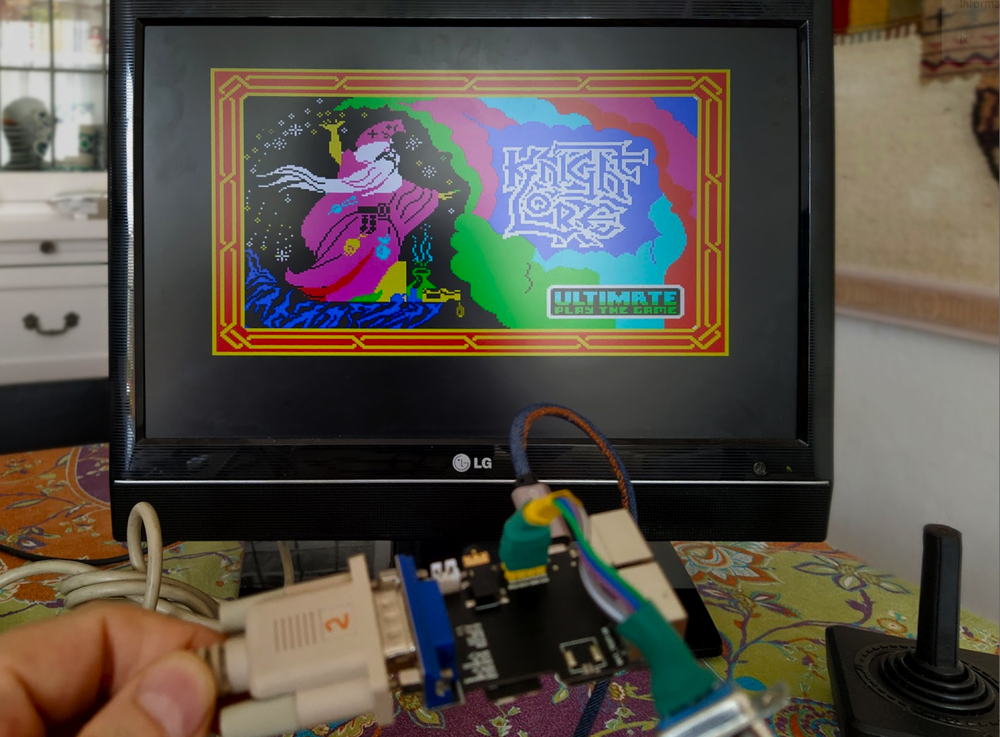

# ZX Spectrum screen loader for FabGL devices
ZX Spectrum screen loader with FabGL Library

Just a small tool to visualize zx spectrum screens 16384,6912.

Thanks to www.FabGL.com - 2019 by Fabrizio Di Vittorio for this amazing library. 

Thanks to Shenzhen Xin Yuan Electronics for the funny TTGO VGA32 http://www.lilygo.cn/.

I've enjoyed playing with it.

22/8/2020 - Version 0.1

https://github.com/carlesoriol/fabgl_zxloader

Carles Oriol - Barcelona 2020
carlesoriol@gmail.com

## Device Picture

## License
[AGPL](https://choosealicense.com/licenses/agpl/)
